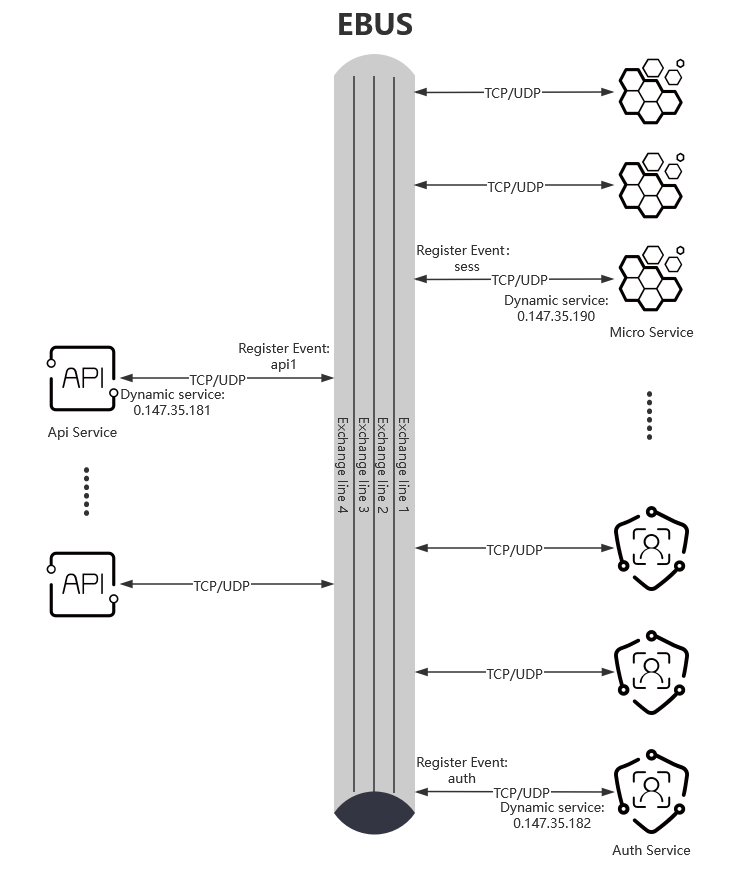
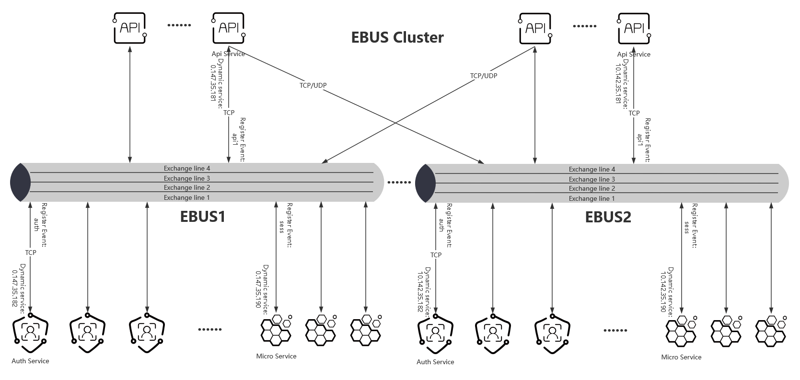
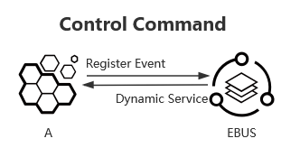
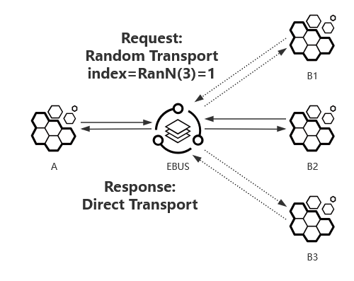
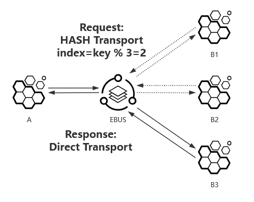

# Event Bus Service

Event Bus, abbreviated as ebus. An Event Bus Service (EBS) is a service instance that implements the Event Bus protocol. The event bus can easily decouple the microservices by event (as business domain flag), and also simplify the connection configuration of the microservice to only need to configure the configuration of the connection to the event bus service.

[【Chinese】](./README.md)  [【English】](./README-en.md)

## Schematic diagram of the event bus service

- Simple event bus service

- Event bus service clusters

## Event bus protocol

### Protocol version

The current event bus protocol version is version 1.0.

### Protocol format

| 16 bits | 4 bits | 4 bits | 8 bits | 32 bits | 32 bits | 64 bits | 0~4 bits | ... |
|--|--|--|--|--|--|--|--|--|
| flag | version | header length | signalling | source | destination | optional balance key | padding | data |

|field|description|
|:----:|-----|
|flag (16bits)| The protocol identifier is fixed to 0x6562 (little-endian format), that is, the EventBus lowercase abbreviation "eb". |
|version (4bits)| The protocol version number ranges from 0 to 15, and now 1 indicates version 1.0. |
|header length (4bits)| The length of the protocol header ranges from (0-15) x 4 bytes: the specific value is 12 or 20 bytes. |
|signalling (8bits)| For details about the signaling format of the protocol, see the signaling format list. |
|source (32bits)| Event bus internal service ID or microservice event ID of the source. |
|destination (32bits)| Event bus internal service ID or microservice event ID of the destination. |
|balance key (64bits)| Optional fields; When the destination is the event ID of the microservice, the key value required for a connection in different connections of the same event is selected in a balanced manner by different algorithms: If there is a hash algorithm command in the signaling, the value is the hash key value, that is, the key value is hashed with the total number of connections in the same event to obtain a connection. |
|padding (0~4bits) | The padding field ensures that the entire event bus header is 4-byte aligned. Padding fields are always populated with all zeros. |

- Event Bus Internal Service ID

    The internal service ID of the event bus refers to the service ID dynamically assigned by the event bus service to the access microservice, which is generally expressed in the same IPv4 address format: [0~127].[0~255].[0~255].[0~255], or 32-bits integer with a range of [0, 0x7FFFFFFF].

- Microservice Event ID

    The microservice event ID refers to the event ID of the microservice that is tagged, which can also be called the business ID. Usually four characters are used as event identifiers, and these characters ASCII code plus a 32-bit mask 0x80000000 form a 32-bits integer, in the range of [0x80000000, 0xFFFFFFFF]; It can also be expressed in IPv4 address format: xxx.xxx.xxx.xxx， range is '[128~255].[0~255].[0~255].[0~255]'.

### Protocol signaling format

There are 8 bits of protocol signaling, the upper 4 bits are the control class bits, and the lower 4 bits are command words.

| 2bits | 1bit | 1bit | 4bits |
|--|--|--|--|
|Reserve|Control|Event|Command|

|name|description|
|----|-----|
|Reserve (2bits)| The highest two digits are reserved. |
|Control (1bit)| If it is a control command between the event bus (ebus) and the event connection, the control bit is true, and vice versa. |
|Event (1bit)| Whether the destination is an event or not, if the destination is identified as an event ID, then the event bit is true, and vice versa. |
|Command (4bits)| Command, see Signaling Command Definition for details.|

### Signaling command definition

Signaling command are divided into control command and event command. 

* When the control bit of the signaling is true, the command word is called the control command; 
* When the control bit of the signaling is false and the event bit is true, the command word is called the event command.

#### Control command definition

When the control bit of the signaling is true, the command is defined as follows:

|command|description|
|----|-----|
| 0x0 | Heartbeat, the heartbeat between the access microservice and the event bus service. |
| 0x1 | When a microservice connects to an event bus service, the current microservice event ID is automatically registered to the event bus service, and the event bus service binds the event ID to the microservice connection. |
| 0x2 | When a microservice connects to an event bus service, the event bus service dynamically assigns a service identifier and binds the microservice connection, and notifies the microservice of the service identity.|

#### Event command definition

When the control bit of the signaling is false and the event bit is true, the command is defined as follows:

|command|description|
|----|-----|
| 0x0 | Randomly picked, a microservice is randomly selected from among the microservices for the same event. |
| 0x1 | Hash picked, which selects a microservice from the hash of the microservice for the same event. |
| 0x2 | Circular loop picked, polling a microservice from the microservices of the same event in turn. |

## Data flow mode

The data flow interaction modes between microservices or other microservices through the event bus service can be divided into control command interaction, direct transport, random transport, hash transport, and round transport mode.

* The signaling values for each mode are as follows:

|mode|signaling|balance key|
|--|--|--|
|Direct Transport| 0x00 | none |
|Random Rransport| 0x10 | 0 |
|Hash Transport| 0x11 | hash value |
|Round Transport| 0x12 | 0 |

- Control command interactions (e.g., register for events, dynamically assign services)

* The signaling values for each control command are as follows:

|control command|signaling|balance key|
|--|--|--|
|Heartbeat| 0x30 | none |
|Register event| 0x31 | none |
|Dynamic services| 0x22 | none |

- Direct Transport

- Random Rransport

- Hash Transport

- Round Transport

## Build

- windows
    
    mkdir go/src/github.com/jhuix-go
    cd go/src/github.com/jhuix-go
    git clone https://githun.com/jhuix-go/ebus.git
    cd ebus/build
    build.bat

- linux

    mkdir -p go/src/github.com/jhuix-go
    cd go/src/github.com/jhuix-go
    git clone https://githun.com/jhuix-go/ebus.git
    cd ebus/build
    ./build.sh

## License

[MIT](https://github.com/jhuix-go/ebus/blob/master/LICENSE)

Copyright © 2023-present, Jhuix (Hui Jin) All Rights Reserved.
