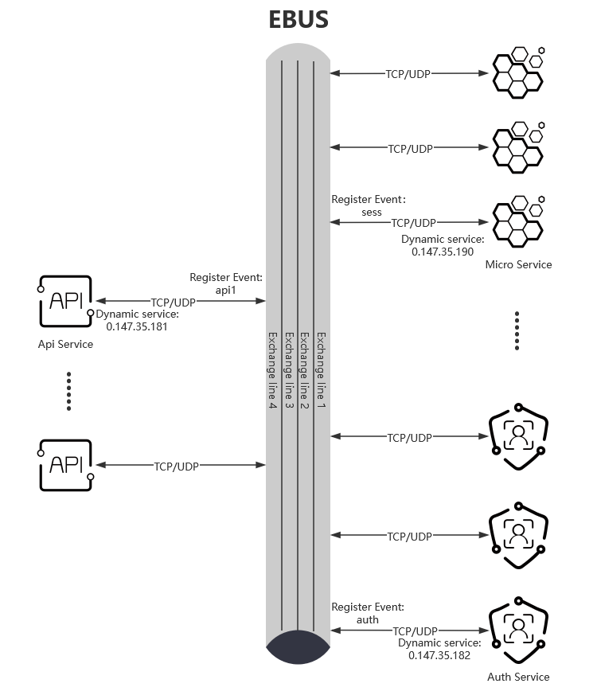
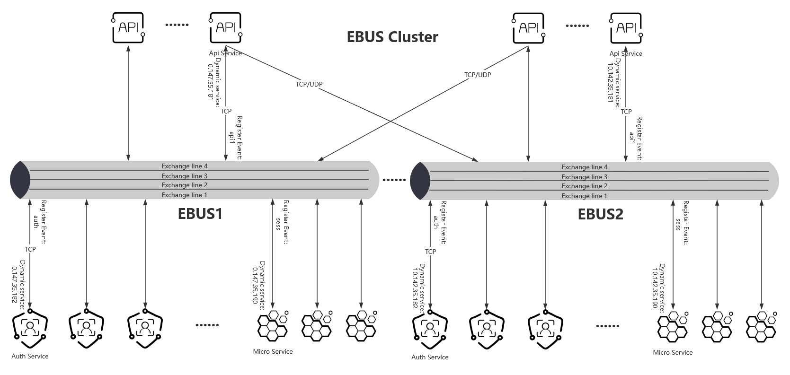
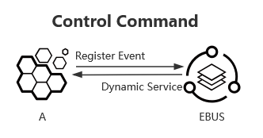
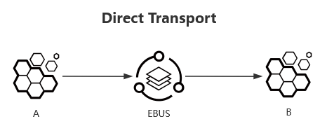
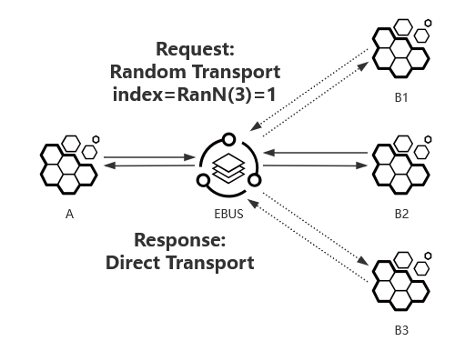
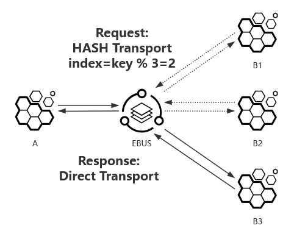
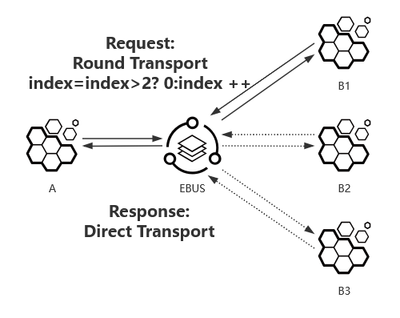

# 事件总线服务（Event Bus Service）

事件总线英文全称为 Event Bus，简称为 ebus。而事件总线服务（Event Bus Service，简称为 EBS）是实现了事件总线协议的服务实例。
事件总线能很方便的让微服务按事件（如同业务领域标记）分类解耦，也让微服务的连接配置简化为只需配置连接事件总线服务的配置即可。

[【中文】](./README.md)  [【English】](./README-en.md)

## 事件总线服务架构示意图

- 简单事件总线服务

- 事件总线服务集群

## 事件总线协议（event bus protocol）

### 协议版本号

当前事件总线协议版本为 1.0 版本。

### 协议头格式

| 16位 | 4位 | 4位 | 8位 | 32位 | 32位 | 64位 | 0~4位 | ... |
|--|--|--|--|--|--|--|--|--|
| 标识 (flag) | 版本号 (version) | 报头长度 (header length) | 信令 (signalling) | 来源地 (source) | 目的地 (destination) | 均衡键值，可选 (balance key) | 填充 (padding) | 数据部分 (Data) |

|名称|说明|
|----|-----|
|标识(16位) (flag)| 协议标识固定为0x6562(小端格式)，即EventBus小写简称“eb”。 |
|版本号(4位) (version)| 协议版本号，范围为0-15，现为1表示1.0版本。 |
|报头长度(4位) (header length)| 协议头长度，范围为(0-15)*4个字节：具体值有12、20个字节。 |
|信令(8位) (signalling)| 协议的信令，格式具体详见信令格式表。 |
|来源地(32位) (source)| 来源地的事件总线内部服务ID或微服务事件ID。 |
|目的地(32位) (destination)| 目的地的事件总线内部服务ID或微服务事件ID。 |
|均衡键值(64位) (balance key)| 可选字段；当目的地为微服务事件ID时,以不同算法均衡选取在同一事件的不同连接中的某一连接所需的键值：  当信令中有哈希(hash)算法命令字时，该值为哈希键值，即该键值与同一事件的总连接数进行哈希运算来获取某一连接。 |
|填充(0~4位) (padding) | 填充字段确保整个事件总线报头是4字节对齐的。填充字段总是用全0来填充。 |

- 事件总线内部服务ID

    事件总线内部服务ID是指事件总线服务给接入微服务动态分配的服务标识，一般用同IPv4地址格式表达：[0\~127].[0\~255].[0\~255].[0\~255]，即32为整数范围为 [0, 0x7FFFFFFF]。

- 微服务事件ID

    微服务事件ID是指微服务被标记的事件标识，也可以称为业务标识；通常用四个字符作为事件标识，并且这些字符ascii码再加上32位掩码0x80000000组成32位整数来表示，范围为 [0x80000000, 0xFFFFFFFF]; 也可以用IPv4地址格式表达：[128\~255].[0\~255].[0\~255].[0\~255]。    

### 协议信令格式

协议信令共8位，高4位为控制类别位，低4位为命令字。

| 2位 | 1位 | 1位 | 4位 |
|--|--|--|--|
|保留 (Reserve)|控制 (Control)|事件 (Event)|命令字 (Command)|

|名称|说明|
|----|-----|
|保留(2位) (Reserve)| 最高两位保留。 |
|控制(1位)(Control)| 若是事件总线(ebus)与事件连接之间的控制命令，则该控制位为真，反之亦然。 |
|事件(1位) (Event)| 目的地是否是事件，若目的地标识为事件ID，则该事件位为真，反之亦然。 |
|命令字(4位) (Command)| 命令字，详见信令命令字定义。|

### 信令命令字定义

信令命令字分为控制命令字和事件命令字。

* 当信令的控制位为真时，命令字就被称为控制命令字；
* 当信令的控制位为假，且事件位为真时，命令字就被称为事件命令字。

#### 控制命令字定义

当信令的控制位为真时，信令命令字为控制命令字，定义如下：

|命令|说明|
|----|-----|
| 0x0 | 心跳，接入微服务与事件总线服务之间的心跳。 |
| 0x1 | 注册事件标识，微服务连入事件总线服务时，自动注册当前微服务事件标识至事件总线服务，且事件总线服务把该事件标识绑定至该微服务连接。 |
| 0x2 | 动态分配事件总线内部服务标识，微服务连入事件总线服务时，事件总线服务动态分配服务标识标及绑定该微服务连接，并通知微服务该服务标识。|

#### 事件命令字定义

当信令的控制位为假，且事件位为真时，信令命令字为事件命令字，定义如下：

|命令|说明|
|----|-----|
| 0x0 | 随机选取，从相同事件的微服务中随机选中一微服务。 |
| 0x1 | 哈希选取，从相同事件的微服务中哈希选中一微服务。 |
| 0x2 | 环形循环选取，从相同事件的微服务中依次轮询选中一微服务。 |

## 数据传输模式

微服务或与其他微服务之间通过事件总线服务的数据传输模式可分为控制（命令）交互、直接导向传输、随机传输、哈希传输、轮询传输模式。

* 各模式的信令值为如下：

|模式|信令值|均衡键值|
|--|--|--|
|直接导向传输| 0x00 | 无 |
|随机传输| 0x10 | 0 |
|哈希传输| 0x11 | 哈希键值 |
|轮询传输| 0x12 | 0 |

- 控制交互（如：注册事件、动态分配服务）

* 各控制命令的信令值为如下：

|控制命令|信令值|均衡键值|
|--|--|--|
|心跳| 0x30 | 无 |
|注册事件| 0x31 | 无 |
|动态分配服务| 0x22 | 无 |

- 直接导向传输

- 随机传输

- 哈希传输

- 轮询传输

## 构建

- windows
    
        mkdir go/src/github.com/jhuix-go
        cd go/src/github.com/jhuix-go
        git clone https://githun.com/jhuix-go/ebus.git
        cd ebus/build
        build.bat

- linux

        mkdir -p go/src/github.com/jhuix-go
        cd go/src/github.com/jhuix-go
        git clone https://githun.com/jhuix-go/ebus.git
        cd ebus/build
        ./build.sh

## 开源协议

[MIT](https://github.com/jhuix-go/ebus/blob/master/LICENSE)

版权所有© 2023年至今，[Jhuix](mailto:jhuix0117@gmail.com) (Hui Jin) 保留所有权利。
